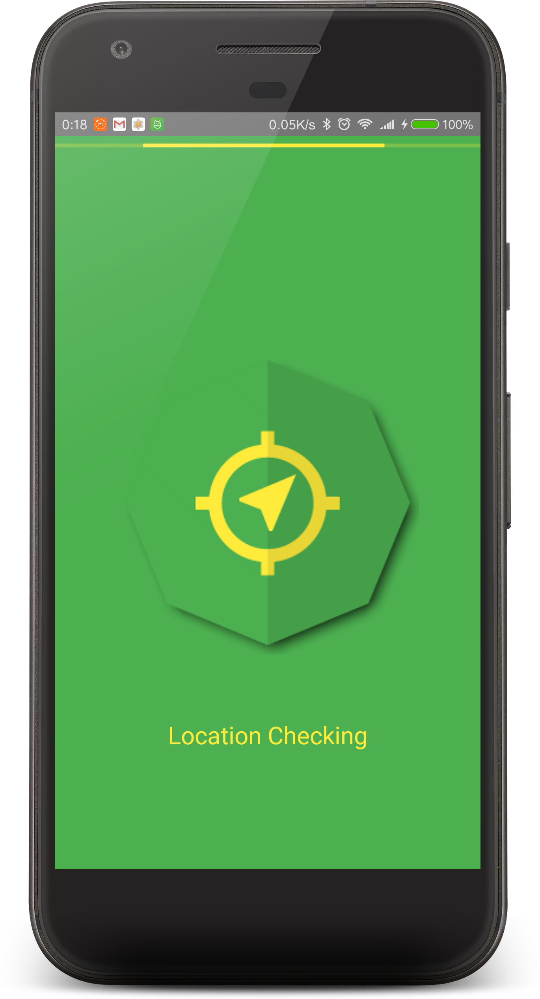
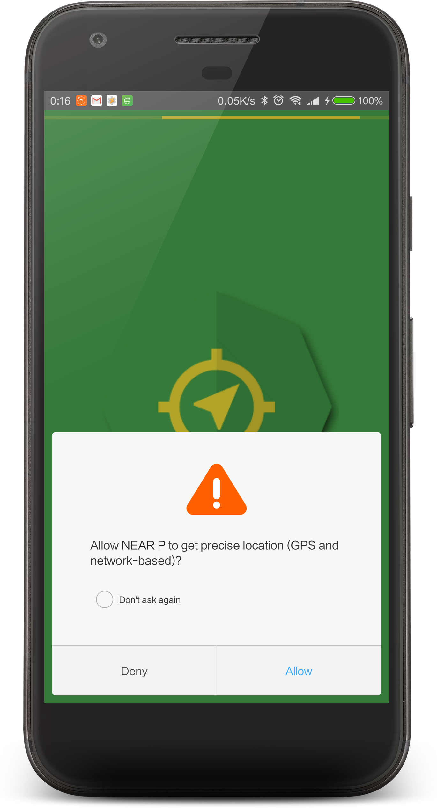
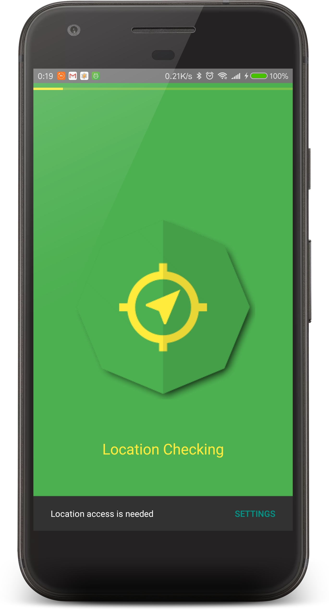
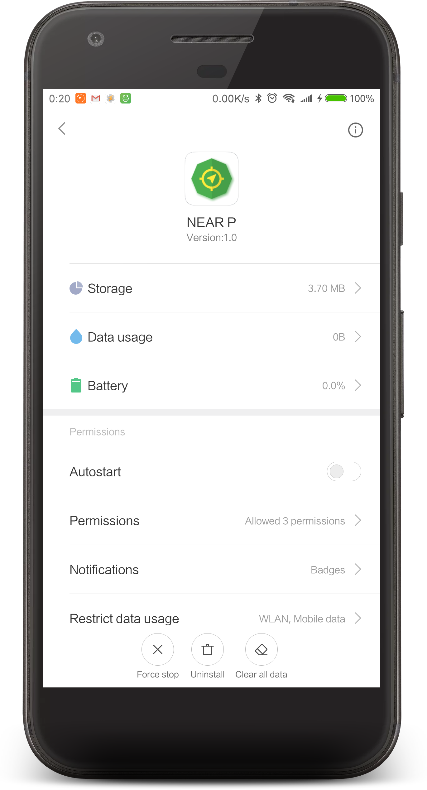
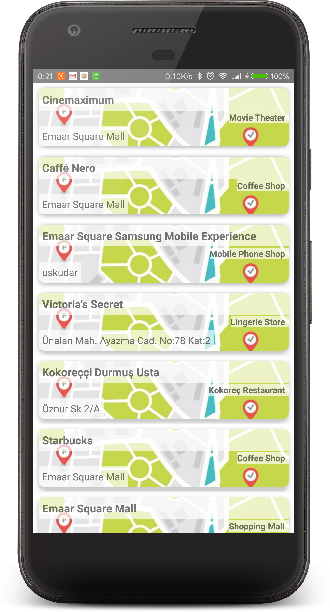
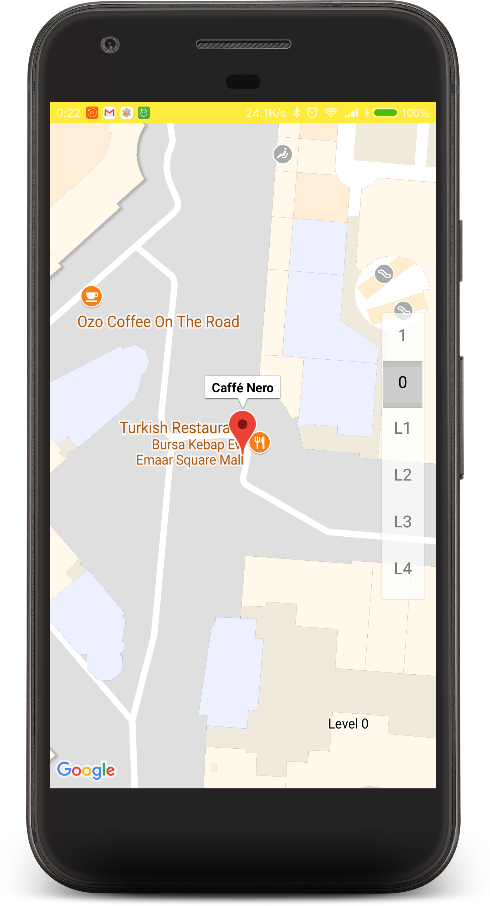
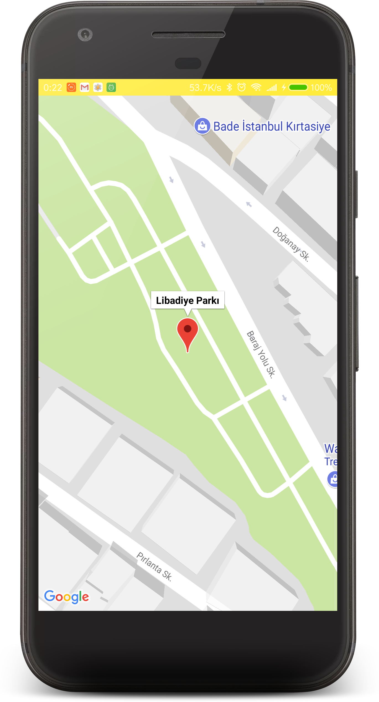
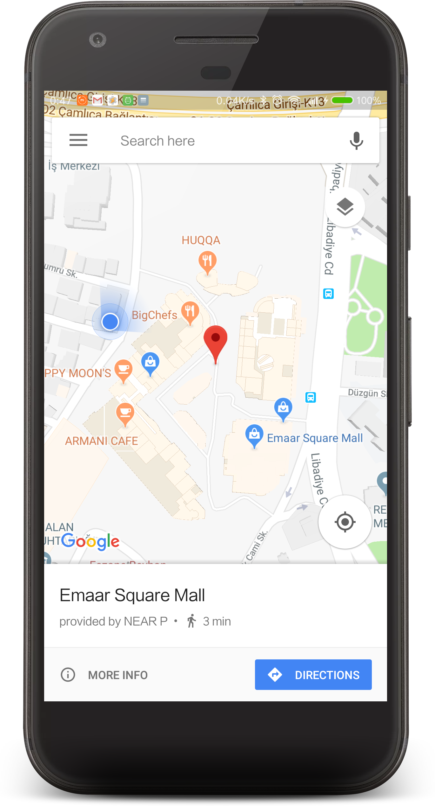

# nearP
Foursquare API ile çevrenizdeki mekanları gösterir.

- Splash Screen üzerinde kullanıcıdan izinlerin istenmesi ve lokasyonun alınması
- Sonraki ekranda Retrofit üzerinden datanın çekilmesi ve listelenmesi
- Liste üzerinden bir yer seçildiğinde yüklüyse Google Map App üzerinde değilse MapActivity üzerinde açılması

**Kullanılan Kütüphaneler**
- Foursquare servisine bağlanmak ve Json datayı parse etmek için Retrofit 2
- İzinleri handle etmek için Dexter
- Model dosyalarını ve bazı kısımları Kotlin ile kalan projeyi Java​ ile​
- UI için support.v7 kütüphanesinden CardView , Recyl​e​view , Snackbar gibi view elemanlarını kullanarak hazırlandı.

